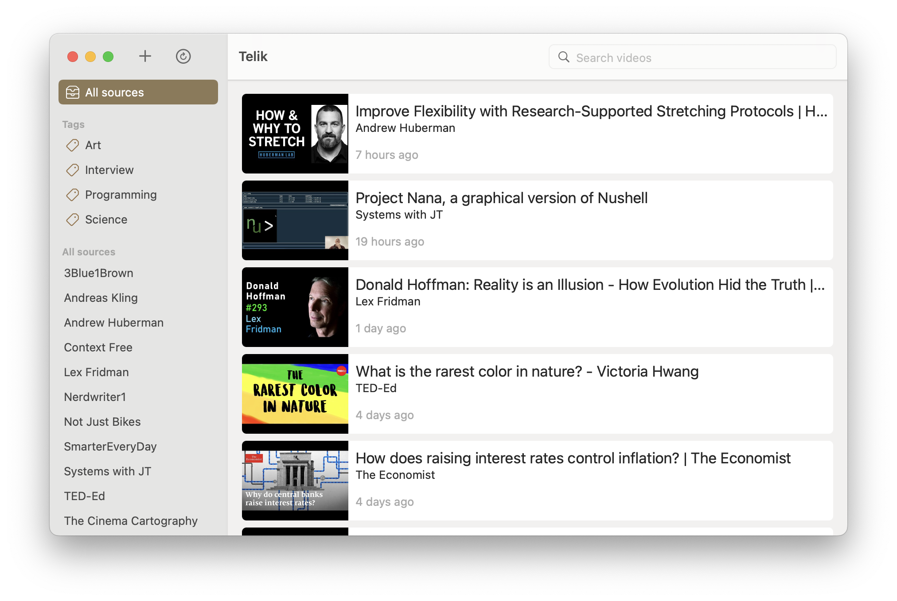

<table>
  <tr>
    <td>
      
    </td>
  </tr>
</table>
  
# Telik

**[Download](https://github.com/agentcooper/Telik/releases/latest/download/Telik.app.zip)**

Telik is a macOS application to track YouTube channels and playlists.

Though similar functionality is available on youtube.com, when using Telik there are no distractions such as recommendations, likes, or comments. It is also not possible to subscribe to a particular playlist on the website.

Channels and playlists can be grouped using tags.

No YouTube account is needed to use Telik and you keep your data to yourself.



Export and import is available, for example you can get all my channels and playlists by pressing ⌘ N and pasting:

```
1. [вДудь](https://www.youtube.com/channel/UCMCgOm8GZkHp8zJ6l7_hIuA/videos) #Russia
2. [Systems with JT](https://www.youtube.com/channel/UCrW38UKhlPoApXiuKNghuig/videos) #Computers
3. [Сергей Гуриев](https://www.youtube.com/channel/UCZ-ix1fUTguJvwj6sxgF-6A/videos) #Russia
4. [3Blue1Brown](https://www.youtube.com/channel/UCYO_jab_esuFRV4b17AJtAw/videos) #Science
5. [Super Bunnyhop](https://www.youtube.com/channel/UCWqr2tH3dPshNhPjV5h1xRw/videos) #Games
6. [videogamedunkey](https://www.youtube.com/channel/UCsvn_Po0SmunchJYOWpOxMg/videos) #Games
7. [LastWeekTonight](https://www.youtube.com/channel/UC3XTzVzaHQEd30rQbuvCtTQ/videos)
8. [ещёнепознер](https://www.youtube.com/channel/UCNRYbltJXhf6DepS26-uSbQ/videos) #Russia
9. [KRAZAM](https://www.youtube.com/channel/UCgBVkKoOAr3ajSdFFLp13_A/videos) #Comedy
10. [Better Ideas](https://www.youtube.com/channel/UCtUId5WFnN82GdDy7DgaQ7w/videos)
11. [Stand-Up Club #1](https://www.youtube.com/channel/UC3cJiUuZlpF-pkzqvSskTpg/videos) #Comedy
12. [Людвиг Быстроновский](https://www.youtube.com/channel/UCdfSFsVtyfF6-FqULDiA6zw/videos)
13. [Радио Долин](https://www.youtube.com/channel/UCe5_WsZ_7RM14t3MImLWNZg/videos)
14. [The Cinema Cartography](https://www.youtube.com/channel/UCL5kBJmBUVFLYBDiSiK1VDw/videos)
15. [Context Free](https://www.youtube.com/channel/UCS4FAVeYW_IaZqAbqhlvxlA/videos) #Computers
16. [Lex Fridman](https://www.youtube.com/channel/UCSHZKyawb77ixDdsGog4iWA/videos)
17. [Редакция](https://www.youtube.com/channel/UC1eFXmJNkjITxPFWTy6RsWg/videos) #Russia
18. [LABELCOM](https://www.youtube.com/channel/UCNqktdxgAADBj36dC7VGOgg/videos) #Comedy
19. [Антон Птушкин](https://www.youtube.com/channel/UClI9aidW3X044NeB4QS-yxw/videos)
20. [Veritasium](https://www.youtube.com/channel/UCHnyfMqiRRG1u-2MsSQLbXA/videos) #Science
21. [Скажи Гордеевой](https://www.youtube.com/channel/UCpJuziZAwEFnoeNGSaxQlCQ/videos) #Russia
22. [«А что случилось?» с Александром Долгополовым](https://www.youtube.com/playlist?list=PLMnzjxOFrGPnK_CtpsF6Qa_knNg7QyHzF) #Comedy
23. [Wendover Productions](https://www.youtube.com/channel/UC9RM-iSvTu1uPJb8X5yp3EQ/videos)
```

---

Name Telik ([`[ˈtʲelʲɪk]`](https://en.wiktionary.org/wiki/телик)) comes from <i>televízor</i> and informally means "TV" in Russian language.